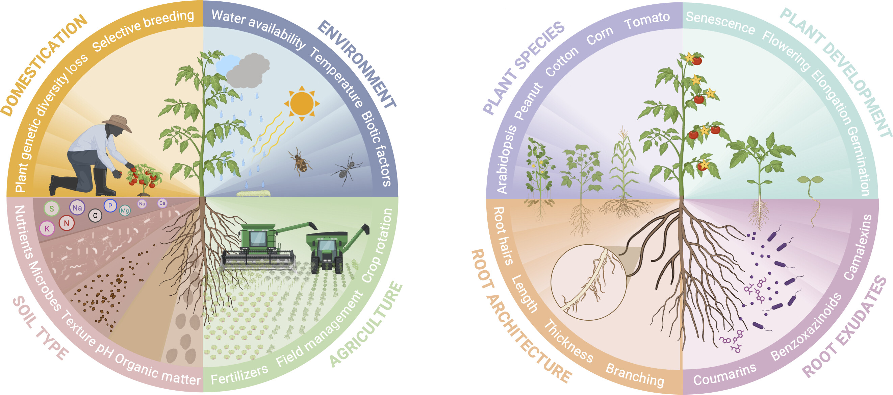

## The role of plant host genetics in shaping the composition and functionality of rhizosphere microbiomes

> 发表日期：2025年7月11日
>
> 作者：María Negre Rodríguez https://orcid.org/0009-0009-7827-1234, Adele Pioppi https://orcid.org/0009-0005-7400-8464, Ákos T. Kovács https://orcid.org/0000-0002-4465-1636
>
> 单位：荷兰莱顿莱顿大学生物研究所

### 摘要

植物微生物组包含与不同植物组织关联的广泛微生物类群。过去数十年间，大量研究致力于解析并利用植物根际微生物组以优化植物生长与健康状态。然而，现有研究多聚焦于环境因素，相较之下，植物基因型的潜在影响尚未得到充分探究。事实上，植物基因型通过调控根系形态、渗出物组成等关键因子，直接参与根际生态位的塑造过程。本文系统阐述植物宿主遗传变异如何影响根际微生物组的组装特征与多样性模式，并综述当前解析复杂植物性状及其在宿主-微生物组系统互作中生态效应的研究方法。

#### 引言

随着人类文明演进，农业系统持续发展以应对人口增长带来的需求。这一进程推动了具有优良性状作物的选育以实现增产。然而，干旱、病虫害及养分亏缺等环境挑战的加剧，使得对高效作物管理策略的需求日益迫切。但农药的广泛使用及集约化管理实践对环境造成了负面影响，促使人们寻求更可持续的解决方案。

土壤承载着庞大而多样的微生物群落，激发了对其与植物互作机制的研究兴趣。植物微生物组由与不同植物组织关联的微生物群落构成，可提供病原防护、生长促进、干旱及养分胁迫抗性提升、产量增加等多重益处。鉴于植物相关微生物的显著优势，一个新问题随之产生：哪些因素决定了植物微生物组的构成？对这些互作的精细解析，以及植物如何调控其微生物组的组装与多样性的理解，已成为研究的核心方向。

操控植物微生物组的关键区域聚焦于根际——围绕植物根系的土壤区域，该区域孕育着丰富的微生物多样性。有假设认为，植物通过遗传编码机制调控根际微生物组的组装与多样性，**其中根系分泌物等因子发挥关键作用**[^注1]。通过协调微生物组，植物被认为扩展了其基因组功能；因此，微生物组因其对植物生长的影响被称为"第二基因组"[^注2]。不同植物基因型具有独特的根际微生物群落组成，这暗示植物遗传与微生物组多样性之间存在密切关联，为通过微生物组操控提升作物性能提供了潜在策略。本综述总结了植物遗传影响其微生物组的多个案例，旨在将这一基础认识应用于可持续农业实践。

[^注1]:此处原文引用的是Sci Rep 2017关于棉花微生物组的文献，但是并非直接引用。在Sci Rep 2017这篇文章的前言中有参考文献22：Soil Biology and Biochemistry 2014描述：谷物的光合同化物转移到地下部分的比例可达30-60%，其中40-90%以根际分泌物的形式释放，这些分泌物在植物根系与土壤微生物的相互作用中发挥了关键作用。
[^注2]:2013年，Genome Biology第一次提出植物第二基因组。

#### 驯化：植物基因型对根际微生物组的影响机制

农业研究长期以来致力于优化作物性状和提高产量，以满足不断增长的人口需求。然而，近期研究已将焦点扩展至作物与其关联微生物组的复杂相互作用。研究表明，不同作物品种能够招募独特的微生物群落，凸显了植物遗传特性在塑造根际微生物组中的关键作用。这一发现为靶向农业实践开辟了新途径，使微生物组管理成为提升作物健康和产量的核心策略。

植物进化历史对根际微生物组的影响在驯化过程中尤为显著。当今广泛种植和食用的作物大多源自数千年来对理想性状的人工选择。驯化过程中，目标遗传位点的多样性被降低以偏好特定性状，其他位点也随之消失。相关基因的多样性丧失导致仅有目标等位基因在后代中传播。传统观点认为，遗传多样性的减少会直接影响植物与有益根际微生物建立关联的能力，而集约化农业实践和向新种植区域的扩张则削弱了野生品种特有的重要植物-微生物互作关系。这一普遍接受的假说近期受到更大规模研究的挑战，这些研究对比了多种植物的野生和驯化品种。Hernández-Terán团队开展的meta分析总结了多项在相同 bulk 土壤中种植野生和驯化植物的研究，结果显示驯化品种的微生物群落α多样性高于其野生近缘种，涉及小麦、番茄和棉花等作物。值得注意的是，玉米和豆类的野生品种通常表现出更高的微生物多样性。该研究还指出，宿主基因型对不同植物物种间微生物变异的解释力较弱，而种内变异性相对较高，尤其是当考虑不同初始土壤条件时。这些发现表明，植物驯化对根际微生物组的影响无法一概而论，而是呈现物种特异性和土壤依赖性。驯化对特定植物微生物组的影响可能更多体现在功能相关性方面，这些功能介导了植物与动态环境的相互作用。此外，微生物组还可通过人工选择涉及植物-微生物组互作的性状而受到间接影响，例如直接选择种子大小和营养成分，或通过改变植物渗出物组成和防御能力实现。

根际微生物组的组装被广泛认为是一种过滤机制，植物通过此机制选择关联微生物，这为不同品种间微生物组差异提供了替代解释。若植物在驯化过程中逐渐丧失微生物组选择相关基因，将导致其微生物组过滤能力受损，这可能解释了部分现代作物观察到的更高微生物组多样性现象。目前已有明确证据表明，野生品种与其驯化后代的微生物组存在显著差异。然而，基因型对野生和驯化宿主根际微生物群的影响可能仍较为微妙。

#### 环境与基因型因素对微生物组的综合影响

除植物基因型外，环境因素尤其是土壤类型显然是根际微生物组变化的关键决定因素。土壤类型由非生物因素（如质地、有机质含量、pH、植物可用养分）和生物因素（特别是土壤原有微生物组）共同决定。植物根系通过与周围土壤相互作用，与本土土壤微生物组的子集形成更紧密的关联；因此，最终形成的根际微生物组依赖于特定地点的原有微生物群落。

除土壤类型外，气候条件和人为干预同样参与塑造植物微生物组。水分供应和温度是植物健康与生长的基本决定因素，同时通过形成不同环境生态位影响土壤群落结构。此类非生物因素导致的植物胁迫已被证实会改变根际微生物组。此外，农业活动中的人工干预（如施肥、化学农药施用）也是驱动作物微生物组变化的重要因素。

环境与植物基因型对根际微生物组的相对影响程度难以完全界定，不同实验体系的研究结论可能存在细微差异。但已有研究通过综合分析土壤与基因型因素，对植物微生物组展开系统性探究。其中多项研究对比了野生与现代作物品种在不同土壤类型中的根际微生物组特征——通常包括农业土壤和植物原栖息地的自然土壤。例如，菜豆的根际微生物组在农业土壤中生长时受基因型影响更显著，而在原生土壤中这种影响较弱。但值得注意的是，农业土壤整体表现出更高的根际细菌多样性，且现代菜豆品种无论种植于何种土壤类型均呈现更高的多样性水平。这表明在自然环境中，基因型与环境必然存在交互作用，两者对根际微生物组的相对贡献具有情境依赖性（图1）。

由于土壤类型及其他环境因素对植物根际微生物组组成具有显著影响，分离基因型的直接影响存在挑战。植物基因型作为内在复杂因素，被认为具有"调控"微生物组的功能，这为相关研究增添了重要复杂性。因此，植物基因型对微生物组的直接作用需要谨慎评估，并需综合考虑本综述所阐述的多方面因素。

#### 核心根际微生物组

植物与微生物组的紧密关系在核心微生物组概念中得到充分体现。尽管不同研究对核心微生物组的具体定义可能存在差异，但通常指**在特定植物物种、种群或更广泛群体中持续存在的植物关联微生物子集（[引用14](https://nph.onlinelibrary.wiley.com/doi/full/10.1111/nph.13312)）**。由于这种稳定关联，通常认为这些微生物对植物具有重要功能价值，是植物与微生物组互动的基石。此外，植物分类群内共享的独特核心微生物组暗示，塑造植物最紧密相关微生物群落的动态过程在一定程度上受植物基因型影响。尽管目前对植物微生物组（尤其是核心组分）的描述兴趣日增，但阐明植物与这些微生物的互作机制，以及核心微生物组成与条件性组装微生物组的决定因素仍具挑战。确定植物物种的核心微生物组可作为探索植物关联微生物组与植物遗传及系统发育关联的起点。例如，**Eclipse和CELRK两个菜豆品种在不同种植区域均共享包含258个细菌/古菌类群和13个真菌类群的核心微生物组（[引用15](https://academic.oup.com/ismej/article/15/9/2708/7474623)）**。变形菌门（尤其是节杆菌属）是共享细菌微生物组中最丰富且持续存在的组分，广泛分布于所有种植地点。此外，两品种特有的分类群数量有限且分布不稳定。此案例中，<u>根际微生物组的差异无法归因于植物基因型，而更可能与栽培条件相关</u>。

核心微生物组在系统发育距离较远的植物物种间往往差异更显著，但微生物组组成究竟主要受环境还是植物自身遗传特征塑造仍不明确。Yeoh等研究了自然生长于六种连续植被类型的31种植物根际微生物组。尽管发现土壤类型对根际微生物组有显著影响，但植物系统发育也与根际群落组成相关，而这一现象在非根际土壤样本中未被观察到，表明研究区域的根际微生物组通过与特定宿主的进化过程独特形成。除宿主特异性微生物组特征外，研究者还强调所有植物门类间存在共享微生物子集，即系统发育范围的核心微生物组，提示某些紧密的植物-细菌关联可能早在近期植物谱系进化前就已建立。**（[引用16](https://www.nature.com/articles/s41467-017-00262-8)）**

然而，目前仍不明确核心微生物组组成是否真正反映各植物物种的遗传特征，或动态分布的成员是否实际体现各物种与环境互动的独特能力。

#### 根际分泌物在塑造根际微生物组中的关键作用

根际分泌物是植物分泌的低分子量化合物，作为周围土壤微生物的重要营养基质和碳源。其成分复杂多样，包含糖类、氨基酸、有机酸、酚类及次生代谢产物等。植物分泌特征具有高度动态性，随物种、发育阶段、土壤类型及环境因素而变化。这些根际分泌物兼具信号分子功能，既能吸引并激活有益微生物，也可抑制或排斥非有益微生物。因此，根际分泌物因其在决定根际微生物群落组装与多样性中的确证作用而备受关注。例如，苯并噁唑嗪类化合物（BXs）是禾本科植物（如玉米、小麦、黑麦）根系产生的吲哚类次生代谢产物，兼具杀菌作用和招募促生细菌的双重功能。Cotton等发现BX生物合成基因突变可改变玉米根际微生物组，证实这些基因属于塑造根际微生物组的植物信号调控网络。

Kudjordjie团队将玉米根系BX水平与基因型关联分析，发现BX通过塑造微生物簇显著影响根际真菌而非细菌群落。BX与特定植物病原菌（如引起玉米病害的镰刀菌属）呈负相关，同时促进假单胞菌属和伯克霍尔德菌属等有益微生物的活动，这些微生物可促进植物生长并增强防御能力。

近期研究强调植物分泌的肌醇在调控细菌根际群落中的关键作用。O’Banion等研究表明肌醇运输影响细菌群落的组成与行为，该代谢物可调控细菌定殖表型（如游动能力）。Sánchez-Gil等进一步发现假单胞菌属保守的iol基因簇使其具备高效代谢肌醇的能力，该基因簇的存在增强了假单胞菌在根际的竞争力，促进其与植物宿主的互作。这表明植物通过分泌肌醇选择性吸引特定微生物，创造促进有益微生物定殖的生态位。

除调控功能外，根际分泌物还具有防御机制。例如，多种植物分泌的香豆素兼具抗菌和铁动员功能，可促进增加植物铁供应的微生物生长。拟南芥产生的camalexin类抗菌化合物可选择性抑制叶部病原菌（如水稻纹枯病菌PG1），同时允许假单胞菌CH267等有益菌生长。这些案例体现了植物通过动态调节分泌物浓度调控微生物组的能力。

植物免疫系统通过复杂网络限制微生物定殖，产生抗菌物质并监控特定微生物。根际分泌物作为动态介质，部分受水杨酸（SA）、茉莉酸（JA）和乙烯等植物激素调控。这些激素通过调节系统防御反应和根际分泌物组成，反作用于根际微生物的招募。Lebeis等发现水杨酸生物合成途径突变导致拟南芥根际微生物组显著变化，表明SA参与排除特定细菌类群。Carvalhais等则指出茉莉酸信号改变直接影响根际分泌物组成，进而调控细菌和古菌群落。

理解根际分泌物对根际微生物组的影响需结合作物驯化如何塑造植物进化，包括野生近缘种与现代品种的遗传及表型差异。例如，不同驯化阶段的小麦品种在糖分泌模式和表型上存在分化：野生品种应激抗性更强，而现代品种地上部生物量更大且糖分泌水平显著更高，提示现代品种调控糖分泌的能力可能弱于野生近缘种。这种差异在关联根际微生物组变化时更为显著。一项比较野生种毛茛和现代种拟南芥的meta分析显示，作物野生近缘种通常分泌较少单糖，且根际有益拟杆菌门丰度更高；而驯化品种则倾向于富集放线菌门和变形菌门。这表明驯化通过改变根际分泌模式影响了根际微生物组组成。

进化实验分析四倍体小麦10个基因型的遗传多样性与分泌差异，揭示不同化学代谢物影响微生物群落动态。根际分泌物中的蔗糖和有机酸被认为直接或间接调控根系微生物生长。人类定向选择驱动了特定根际分泌特征的形成，部分代谢物通过选育基因型得以遗传。

除驯化外，植物发育阶段也被认为影响根际分泌。燕麦根际分泌物组成随生命周期显著变化：早期植株分泌更高浓度的蔗糖和同型丝氨酸以支持共生互作与防御；成熟期分泌物种类增加，防御策略优先于生长；衰老期吲哚乙酸和脱落酸等激素分泌增加。研究者推测植物通过遗传能力动态调整根际分泌物组成，以响应环境与发育信号，进而改变根际微生物组模式。

土壤类型对根际分泌及微生物组组成的影响是另一关键环境因素。对不同土壤中生长的生菜（Tizian品种）的研究表明，低分子量糖类分泌差异主要为定量而非定性变化。即使无pH胁迫或养分缺乏等外部压力，土壤理化特性仍显著影响分泌模式，并伴随根际微生物组组成变化，揭示土壤性质、根际分泌与微生物群落结构的直接关联。

尽管驯化、土壤类型及发育阶段对根际分泌的影响研究已取得进展，但植物基因型、根际分泌物组成与微生物组组装间的复杂关系仍需深入探索。例如，单基因突变可能不直接改变根际分泌物或微生物组，而是通过环境因素及多级代谢调控和信号级联产生间接影响。因此，当前亟需开展综合性研究，整合植物遗传、环境因子与土壤微生物组的互作网络。

#### 根结构在塑造根际微生物组中的关键作用

研究植物根际微生物组时，核心争议聚焦于微生物组差异不仅存在于不同物种间，同一物种的不同基因型间也存在差异。这强调了"回归根系"的必要性，即重新关注进化与农艺实践如何塑造古老与现代品种的差异，特别是这些差异对微生物组的影响。

根结构指植物根系在土壤基质中的时空配置，对根际微生物组的塑造起决定性作用。根系构型特征包括根长、密度、生物量、分支模式及侧根与轴根的生长速率等。这些性状直接影响植物对土壤niche的养分与水分吸收，进而调控根际微生物组的多样性与组装。

近期研究显示，调控根毛发育的遗传因子影响根际微生物组组成，尤其在干旱条件下。通过分析根毛密度不同的拟南芥突变体，研究者发现干旱耐受性增强的突变体在干旱胁迫下产生更多次生代谢物，并激活特定代谢通路，将根毛发育与胁迫下的代谢响应关联。研究还支持植物存在"求助信号"机制，干旱胁迫触发根瘤菌科微生物聚集以增强植物抗逆性。这些结果凸显根结构及遗传调控在环境胁迫下对微生物组组成的影响。

Robertson-Albertyn团队比较了两种大麦品种及无根毛或根毛发育受阻的回交近交系在两种土壤中的根毛细菌群落。研究发现土壤类型（尤其是养分组成）显著影响微生物群落，且根毛基因型决定微生物组优势类群。通过分析野生型与突变体的α多样性，发现无论土壤类型如何，根毛突变体的微生物组复杂度均更低。

根结构具有动态性，受土壤结构、氧与养分供应、水分、温度、植物遗传特征及土壤微生物等多因素调控。农业实践的未来方向可聚焦定义根结构与形态的基因，通过育种间接塑造根际微生物组以提升植物健康与产量。例如，选择性育种与驯化形成的莴苣不同根结构创造多样土壤微生境，野生品种根系穿透深层土壤的能力更强，这可能与微生物组差异相关。Rouch等比较现代与古代小麦品种的根结构，发现古代品种根系更长，且不同根结构的小麦品种影响假单胞菌的分类与功能微多样性。

Szoboszlay团队研究玉米驯化对根系构型及根际微生物组的影响，发现栽培玉米与野生祖先（巴尔萨斯墨西哥玉米）的根际细菌与真菌群落存在显著差异。野生种根际细菌多样性更高，而栽培玉米的真菌多样性降低。鉴于微生物组通过养分循环与病原抑制等机制影响植物健康，该发现强调育种需考虑微生物组组成与抗病性。

Pérez-Jaramillo等研究野生与现代菜豆品种的根结构模式如何影响根际微生物组，发现植物基因型解释了13.5%的宿主依赖性根际细菌群落变异。野生品种细根中拟杆菌门丰度更高，而现代品种粗根中放线菌门与变形菌门占优。研究者揭示植物进化史、基因型与根结构模式共同构成细菌根际群落的复杂网络。

其他根结构特征（如根直径、深度与分支）也被认为影响显著。细根与更丰富的根际微生物组相关，可能因物理表面有限促进根际分泌与养分循环，间接加剧微生物竞争。深根使植物触及深层土壤的养分niche并接触更多细菌类群，而增强分支通过扩大表面积促进细根对微生境的利用。此外，根皮层通气组织与根内皮层屏障的亚麻仁沉积影响铁与盐分的流动，进一步调控根结构对养分与水分的获取，从而影响微生物组。

理解根结构与微生物多样性的互作将推动靶向基因改造，同步提升植物性能与微生物健康。

#### 研究植物基因型与根际微生物组的关联

鉴定影响根际微生物组的植物遗传因子仍是开放挑战。植物-微生物互作研究的拓展促进了发现调控微生物组组装与功能的特定植物基因及通路（如根际分泌相关通路）。实验常采用缺失特定基因的突变体揭示基因型对微生物组的影响。Voges等使用由拟南芥共生菌组成的**合成微生物群（SynCom）**，分析不同拟南芥突变体的根际微生物组组成。研究发现，缺失香豆素合成基因的突变体在缺铁条件下假单胞菌属丰度高于野生型，可能与香豆素的抗菌活性相关。

SynComs采用**简化群落**研究宿主决定的生态效应，其复杂度低于自然微生物组，便于解析微生境动态（如微生物间互作及宿主-微生物互作）。例如，SynCom可模拟植物核心微生物组的简化版本。Wippel等测试代表百脉根与拟南芥微生物组的两类SynCom，发现共生菌在其原始宿主中的定殖能力更强。SynCom的简化特性便于检测宿主特征引起的丰度变化。目前尚不明确植物遗传特征是广泛影响整个根际微生物组，还是仅作用于少数微生物类群。若为后者，分析整体微生物组可能低估植物遗传的影响，而简化群落可提供更高分辨率。

现有方法多基于已知复杂植物性状，难以预测与微生物组的关联。**全基因组关联研究（GWAS）**成为生态背景下解析遗传数据的创新手段。GWAS通过输入基因组数据与表型信息，识别与目标性状相关的基因。例如，以微生物组数据作为输入，GWAS可揭示植物基因型与微生物类群丰度的关联。对高粱根际样本的16S扩增子数据进行GWAS分析，发现若干细菌类群具有高度遗传性，其丰度显著依赖宿主基因型。邓等进一步定位到与根局部活性相关的遗传位点，该位点与特定微生物类群的丰度相关。然而，鉴定影响根际微生物组的特定位点受限于表达调控的复杂性，因多重遗传与环境因素可能共同作用。植物遗传特征调控微生物组组装的机制是数百万年进化的产物。Wagner等比较玉米自交系与对应F1杂交系的根际微生物组，推测杂种优势（杂交系性状超越亲本的现象）可能同样体现在微生物组特征中。研究发现个别杂交系存在微生物组杂种优势痕迹，且根际微生物组受更强的宿主基因型效应影响。研究微生物组相关性状的遗传模式有助于将其整合至现有育种策略。

#### 结论

植物微生物组对植物健康与适应性的重要性已得到充分证实，这促使人们愈发关注解析微生物组动态以促进作物生长。植物遗传是影响根际微生物组的关键因素，主要通过调控根际分泌与根结构实现。然而，与微生物组相关的植物性状复杂性远未完全阐明。解析植物遗传与环境因素在塑造根际微生物组中的各自作用仍是一个富有挑战性的课题，特定关键性状的发现、表达机制及遗传规律亦需深入探究。经自然选择塑造的植物性状在驯化与作物育种过程中发生改变，因此，影响微生物组变异的遗传决定因素可能通过性状选择被保留或丢失。整合植物遗传影响根际微生物组的知识，可助力开发利用植物微生物组的可持续农业解决方案。